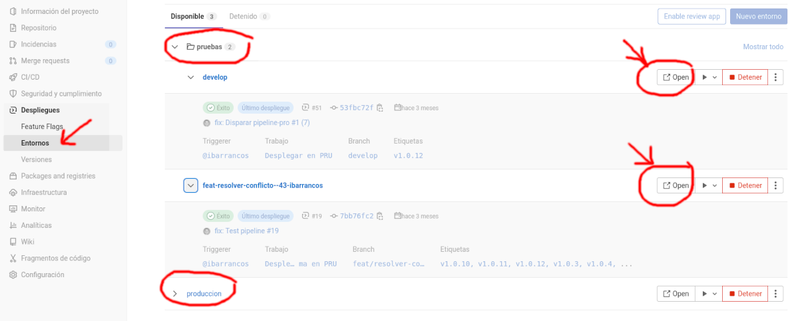
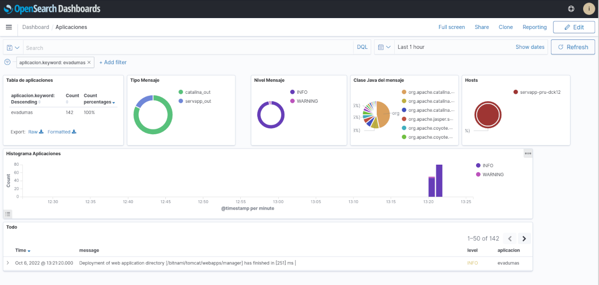
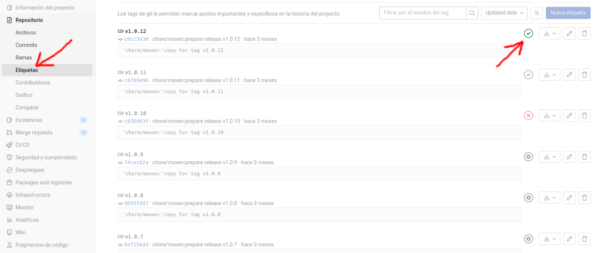
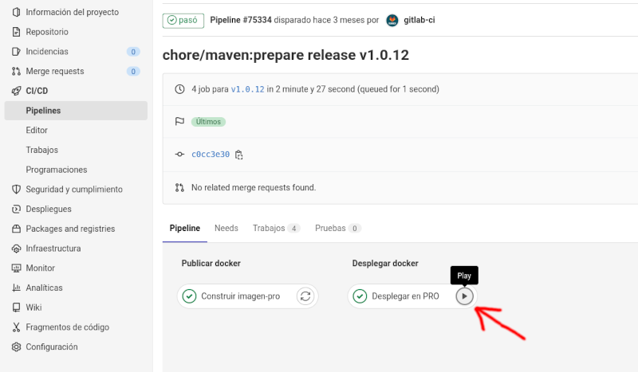
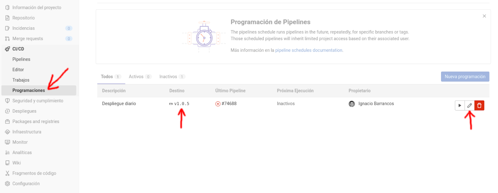

# Entrega y despliegue continuo de aplicaciones


La **entrega continua** _(**continuous delivery** en inglés o CD)_ es una práctica del desarrollo de aplicaciones mediante la que se produce software durante ciclos cortos de tiempo con toda fiabilidad como para poder publicarse en producción en cualquier momento. 

Esto se consigue con entornos de ejecución similares al de producción en los que instalar automáticamente los binarios de nuestra aplicación _(.war, .ear, .exe)_ y así poder realizarles una serie de pruebas automáticas de control de calidad que buscan errores e incoherencias. Cuando todas estas pruebas son satisfactorias, el software queda preparado y validado para desplegarlo en producción a falta de su aprobación por parte del responsable técnico.

El **despliegue continuo** _(**continuous deployment** en inglés o también CD)_ va mas allá en esta automatización y elimina la intervención manual. El despliegue continuo es el resultado natural de una entrega continua bien realizada.


Con esta automatización se consigue:

1. **Liberar** al equipo de desarrollo de realizar **tareas repetitivas** que consumen mucho tiempo
2. **Reducir** el número de **errores e incidencias** y conseguir un desarrollo más confiable
3. Aporta **visibilidad y control** de todos los flujos de trabajo
4. **Reducir costes** operativos. 
5. Ofrecer un **servicio de mayor calidad** y **mejorar la satisfacción** de nuestros usuarios


Si necesitas profundizar más sobre estos conceptos puedes leer:

* El [blog de Martin Flower](https://martinfowler.com/delivery.html)

* Libro [Continuous Delivery: Reliable Software Releases through Build, Test, and Deployment Automation](https://www.amazon.es/Continuous-Delivery-Deployment-Automation-Addison-Wesley/dp/0321601912/) de  D. Farley y J. Humble


## Entornos de ejecución
En el desarrollo de aplicaciones cliente-servidor no es recomendable trabajar directamente sobre los servidores que ejecutan las aplicaciones a las que conectan los usuarios: *Si lo hiciéramos, continuamente se estaría torpedeando el trabajo de los usuarios y los datos no serían confiables*.

Para evitarlo, y al mismo tiempo facilitar el trabajo a los desarrolladores de las aplicaciones, lo que se hace es duplicar los servidores donde se ejecutan las aplicaciones y todo lo que ello implica *(subredes, cortafuegos, bases de datos, servidores de ficheros...)* y agruparlos en lo que se llama **entorno o ámbito de ejecución**. Así, *siempre encontraremos al menos un entorno*: 

1. **Entorno de producción**: Este es el entorno *(servidores de aplicaciones/bases de datos/ficheros, subredes, cortafuegos, etc)* en el que se ejecutan las aplicaciones que utilizan los usuarios finales.

Como el desarrollo de aplicaciones pasa por diferentes fases, se suele hablar como mínimo de:

2. **Entorno de desarrollo**: Este es el entorno que utilizan los programadores mientras modifican las aplicaciones para añadirle nuevas características y corregir errores.
3. **Entorno de pruebas**: Este entorno se utiliza para poder realizar pruebas de funcionamiento de las aplicaciones antes de llevarlas a producción y comprobar su integración con el resto de aplicaciones. También sirve para que los responsables de las aplicaciones validen nuevas funcionalidades e incluso para los cursos de formación.

**Estos entornos se diferencian no solo en el contexto de su uso, si no también en sus requisitos**:  El entorno de producción tendrá unos requisitos de disponibilidad (24x7) y rendimiento máximos, mientras que el entorno de pruebas, aún siendo análogo al de producción, no tendrá sus mismos requisitos, ni tampoco el de desarrollo.


### Entornos en la CARM

En la CARM se dispone de **2 entornos**:

1. **Entorno de producción (*```*.carm.es```*)**. Características:

	Es el entorno donde se ejecutan las aplicaciones que usan los usuarios y ciudadanos.

	* Está configurado en alta disponibilidad con elementos redundantes y balanceados
	* Está monitorizado 24x7
	* Red independiente (no accesible)
	* Los desarrolladores no tienen acceso a la consola de los servidores
  
2. **Entorno de pruebas (*```*pru.carm.es```*)**. Características:

	Es el entorno donde se despliegan las aplicaciones para verificar su funcionamiento en los servidores CARM, su integración con el resto de aplicaciones, validación de los responsables de las aplicaciones y formación.

	* Está configurado en alta disponibilidad con elementos redundantes y balanceados
	* No está monitorizado
	* Red independiente (no accesible)
	* Los desarrolladores no tienen acceso a la consola de los servidores


El **entorno de desarrollo** se  asume que es el equipo de trabajo del desarrollador, aunque **aún existen algunos servicios configurados como *```*-des.carm.es```***, con las siguientes características:

* No está configurado en alta disponibilidad ni con elementos redundantes ni balanceados
* No está monitorizado
* Red independiente (accesible a través de VPN)
* Los desarrolladores suelen tener acceso a la consola de los servidores (vía SSH)


## Despliegue continuo en la CARM

En la CARM implementamos despliegue continuo **únicamente en el entorno de pruebas _(*.pru.carm.es)_**  para  aquellas aplicaciones que así lo soliciten mediante petición de catálogo en GLPI al departamento de sistemas. 

Aparte, el repositorio de la aplicación tendrá que cumplir los siguientes requisitos:
1. **Alojado en [GitLab](https://gitlab.carm.es)**
2. Contendrá un **`directorio docker/` que incluya un fichero `docker-compose.yml`** con la configuración para _docker swarm_ de la arquitectura de la aplicación
3. El fichero **`carm-contract.yml`** en la raíz del proyecto con el _contrato de la configuración_
4. El fichero **`gitlab-ci.yml`**  correspondiente al _pipeline-CD_
5. Un directorio en la rama principal de la aplicación,  con la configuración que se necesita para ejecutar la aplicación en local mediante docker. 

Y además, se debe haber **definido la configuración de la aplicación en el [VAULT](https://vault-admin.carm.es/ui/vault/secrets/apps/list)**

Una vez se ha adaptado la aplicación al _pipeline-CD_, sucederá que cada vez que se realice un push a una rama del proyecto en GitLab, se desplegará automáticamente la aplicación con estos cambios en el entorno de pruebas, dándose de alta en DNS con un nombre especial que la diferenciará del resto.

Para ilustrarlo, supongamos que estamos trabajando en una aplicación llamada `ejemplo`.  El desarrollo principal de la aplicación debería realizarse sobre la rama `develop` y partir de ella, el desarrollo de  nuevas funcionalidades _(`feat`)_  y parches _(`bug`)_, registrados en issues. Además, podríamos tener varios desarrolladores como alicia, juan y ana trabajando en distintos issues:

* Juan está trabajando en la rama `feat/mejoras-formulario-#45`
* Alicia trabaja en la rama `bug/corregir-formatos-#68`
* Y Ana trabaja sobre `feat/nueva-editora-#49`

Y todas estas ramas están basadas en la rama `develop` que se encuentra en la versión `22.4.6-SNAPSHOT`.  Con el uso del _pipeline-CD_ en el proyecto, sucederá que:

* Cuando Juan haga un push de sus cambios al repositorio, sus cambios se publicarán en https://22-4-6-feat-45-juan.ejemplo.pru.carm.es/
* Cuando el push lo haga Alicia, sus cambios se publicarán automáticamente en  https://22-4-6-bug-68-alicia.ejemplo.pru.carm.es/
* Y cuando lo haga Ana, en https://22-4-6-feat-49-ana.ejemplo.pru.carm.es/
* Si Juan realizara cambios sobre la rama de Ana, estos se publicarían como https://22-4-6-feat-49-juan.ejemplo.pru.carm.es/

De esta forma, tanto los responsables de la aplicación como los desarrolladores, pueden revisar y comprobar concurrentemente si los cambios realizados por los distintos desarrolladores resuelven el issue o no. 

Una vez que se fusione una rama a `develop` esta se publicará siempre en https://ejemplo.pru.carm.es. Todo esto quedará accesible desde la consola de GitLab:




Como efecto colateral, **una vez se fusiona una rama en `develop`**, como marca [nuestro flujo](Guia-Versiones.md), **los despliegues que hubiera en ejecución de ramas en desarrollo  _( https://*.ejemplo.pru.carm.es )_ se detendrán y destruirán**, hasta que se vuelva a realizar un push en la rama. De esta forma se invalida el contenido de la rama, y se espera que la rama que partió de `develop` antes de la fusión, se actualice con los cambios fusionados.


Estos despliegues automáticos _https://*.pru.carm.es_  se ejecutan sobre [un cluster docker-swarm](https://geekflare.com/es/docker-swarm/) y por tanto y a causa de su dinamicidad,  **los logs ya no podremos consultarlos en https://corelog.carm.es**, si no en [https://logs-panel-nopro.carm.es/](https://logs-panel-nopro.carm.es/app/dashboards) basado en [OpenSearch](https://opensearch.org/).




## Entrega continua en la CARM

En la CARM, implementamos la entrega continua **únicamente en el entorno de producción _(*.carm.es)_**  con el uso de las siguientes herramientas.


### Jenkins
[Jenkins](https://www.jenkins.io/) es un servidor de integración continua, gratuito, open-source y actualmente uno de los más empleados para esta función.

Esta herramienta, proviene de otra similar llamada Hudson, ideada por Kohsuke Kawaguchi, que trabajaba en Sun. Después de que Oracle comprara Sun, la comunidad de Hudson decidió renombrar el proyecto a Jenkins y migrar [el código a Github](https://github.com/jenkinsci). 

En la CARM decidimos **usar [Jenkins](https://jenkins.carm.es) para orquestar el despliegue de aplicaciones en los diferentes entornos**, y así disponer una consola de gestión de despliegues central (https://jenkins.carm.es) que unificara la forma en la que desplegar las aplicaciones, **cuando aún no implemtamos despliegue continuo mediante pipeline-CD**. 

Jenkins nos permite copiar los artefactos desde Nexus a los servidores de aplicaciones, la configuración de las aplicaciones y reiniciar el servicio, con los siguientes **condicionantes**:

* En el entorno de **desarrollo solo podrán desplegarse ```SNAPSHOTs```** de Nexus.
* En el entorno de **producción solo podrán desplegarse ```RELEASEs```** de Nexus.
* En el entorno de **pruebas se podrán desplegar tanto ```SNAPSHOTs``` como ```RELEASEs```** de Nexus.


Para que una aplicación puede desplegarse desde https://jenkins.carm.es, se necesita **configurar una tarea de despliegue, que podrá solicitarse mediante GLPI de tipo tarea al grupo *"S. Aplicaciones Estándar y Herramientas IC"***.


### GitLab-CD

Para aquellos proyectos en [GitLab que integran el pipeline-CD](https://docs.gitlab.com/ee/ci/introduction/#continuous-delivery), se soporta el despliegue de versiones en el entorno de producción, en dos modalidades:

Una primera **modalidad manual**, desde las versiones etiquetadas de la aplicación, pulsando en el icono del pipeline:



...y luego sobre el  _iconito de `play`_:




Otra segunda **modalidad automática**, programando la ejecución del pipeline a la hora que nos interese:



Mantener activa esta programación con la misma versión, permite **además mantener programado a una hora determinada el reinicio de la aplicación**. 

Como ya debe conocer, las _Etiquetas_ o _tags_ de nuestra aplicación **se generarán con cada fusión a `master`**., que al mismo tiempo publican una RELEASE en [nexus](https://nexus.carm.es).
