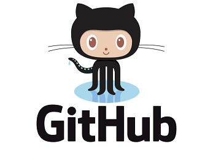

# Uso del Control de Versiones (SCM)

Conforme crece el número de cambios en el código fuente de un programa y el número de personas que intervienen en ellos, se hace más difícil saber cuál es la última versión buena y de quién.  Un sistema de control de versiones es una herramienta que nos ayuda con esto: **facilita la administración de las distintas versiones y modificaciones del código  de un programa y de sus ficheros de configuración** *(del inglés Source Code Management)*, en lo que se conoce como repositorio.
La herramienta se encarga de registrar todos los cambios del repositorio, para poder consultarlos posteriormente o revertirlos, evitándonos tener que hacer copias de seguridad de nuestros cambios.

Durante el desarrollo de un proyecto, lo habitual es que cada programador realice cambios en el código fuente para acometer la tarea que se le ha encargado. Una vez que acaba, los entrega al repositorio de control de versiones (**commit**), de manera que el resto de programadores puedan disponer de ellos, si lo requieren sus correspondientes tareas. Pero podría darse el caso de que **varios programadores trabajen sobre el mismo fichero (o ficheros), en cuyo caso el SCM lo detectará, y actuará** para evitar el conflicto. Además, 

1. permite volver a cualquier punto del desarrollo para ver qué aspecto tenía un determinado fichero de código, o volver a una versión donde todo funcionaba,
2. posibilita que se pueda echar un vistazo para ver quién realizó un determinado cambio, y cuándo lo hizo,
3. facilita poder trabajar en distintas características o resolución de bugs de forma simultánea, guardando los cambios en cada una de ellas, y uniéndolos al desarrollo principal cuando estén listas, mediante lo que **se conoce como ramas o branch**

Estas distintas ramas de trabajo hacen que **veamos el repositorio de código como un árbol**, donde cada una de las ramas representan experimentos, características y correcciones a bugs que se van desarrollando, y que luego vuelven a unirse al tronco principal, que se supone que es la versión que pretende instalarse en producción.
   


Existen multitud de implementaciones de sistemas de control de versiones:
* [CVS](https://www.nongnu.org/cvs/)
* [Subversion](http://svnbook.red-bean.com/)
* [Mercurial](https://www.mercurial-scm.org/)
* [Bazaar](https://bazaar.canonical.com/en/)
* [Git](https://git-scm.com/)

Todos tienen sus características propias, ventajas e inconvenientes, pero **para el desarrollo de proyectos escritos en Java apostamos por Git** frente a [Subversion en la CARM](https://vcs.carm.es), por las razones que a continuación se verán.

## Git
[Git](https://es.wikipedia.org/wiki/Git), es un software de control de versiones  de código abierto creado por Linus Torvalds, pensando en la eficiencia y la confiabilidad del mantenimiento de versiones de una aplicación, cuando éstas tienen un gran número de archivos, precisamente porque lo necesitaba para gestionar el [desarrollo del kernel de Linux](https://github.com/torvalds/linux).

Con la proliferación del uso de Git, comenzaron a surgir los primeros servicios de alojamiento que además ofrecer un servicio Web basado en Git, ofrecían un conjunto de **herramientas online que facilitaban la gestión del proyecto de forma colaborativa**: Wiki, seguimiento de errores, planificación y publicación de versiones, todas integradas con el repositorio de código fuente. De ellas, las más famosas:

* [GitHub](https://es.wikipedia.org/wiki/GitHub),  propietaria, aunque gratuita para repositorios públicos alojados en Internet
* [GitLab](https://es.wikipedia.org/wiki/GitLab), open source que podemos instalar en nuestro servidor o usar desde Internet.

El hecho de que estas aplicaciones integren herramientas para la gestión de proyectos de desarrollo colaborativo junto al propio repositorio, sin requerir de la intervención del administrador, es el principal **motivo por el que se escogió Git frente a Subversion** para el desarrollo de proyectos Java.


### GitHub


Usamos [https://github.com/carm-es](https://github.com/carm-es)  para aquellos proyectos Java que:
1. la licencia abierta nos lo permite,
2. tenemos la necesidad de compartir con otras administraciones públicas,
3. o bien, que adoptamos de la comunidad de código abierto, y sobre los que aplicamos nuestros propios desarrollos personalizados, que luego podríamos revertir a la comunidad.

Para participar en alguno de estos proyectos tendrás que **usar tu propia cuenta de GitHub, o [crearte una](https://github.com/join) si no tienes**, [hacer un fork](http://aprendegit.com/fork-de-repositorios-para-que-sirve/) de alguno de [nuestros proyectos](https://github.com/carm-es)  y realizar [un ```Pull Request```](https://styde.net/pull-request-en-github/) para enviarnos tus cambios.

### GitLab


Usamos [https://gitlab.carm.es/](https://gitlab.carm.es/)  para aquellos proyectos Java que:
1. la licencia no nos permite hacerlos públicos,
2. pueden comprometer la seguridad de nuestros sistemas,
3. gestionan información sensible de los ciudadanos o de la propia administración,
4. o bien, cuando el uso de servicios y herramientas en los procesos de integración continua del proyecto, está limitado o es de pago en GitHub, mientras que en GitLab es gratuito

Para poder acceder al servidor,
1. Asegúrate de tener [cuenta corporativa en IDECRI](https://idecri.carm.es) 
2. Accede con tus credencias corporativas a [GitLab](https://gitlab.carm.es)

Todos los usuarios corporativos adscritos al CRI tienen acceso a GitLab con su contraseña corporativa por defecto, pero si no pudieras acceder a GitLab y sí a IDECRI, tendrás que [poner un GLPI](https://glpi.carm.es) para que se revise la configuración de tu cuenta: **Hasta que no hayas accedido al menos una vez a GitLab, no podremos configurarte los accesos a ningún repositorio**.


### Clientes Git
Para poder entregar tus cambios al repositorio de código fuente necesitarás instalar un cliente Git en tu equipo.

Si instalaste *Eclipse IDE for Enterprise Java Developers* **ya integra un cliente Git**: Si quieres saber cómo [sacarle el máximo provecho no dejes de leer este link](https://wiki.eclipse.org/Es:EGit/Es:User_Guide).

Si usas Windows y quieres integrar el Explorador de Windows con Git deberás **[instalar  TortoiseGit](https://tortoisegit.org/download/) y el correspondiente Language Pack del Castellano**: Después de instalarlo pedirá [instalar el cliente Git de consola](https://github.com/git-for-windows/git/releases)


TO-DO:  1) Uso de git ... links donde lo explican / Mandamientos para el uso del control de versiones.